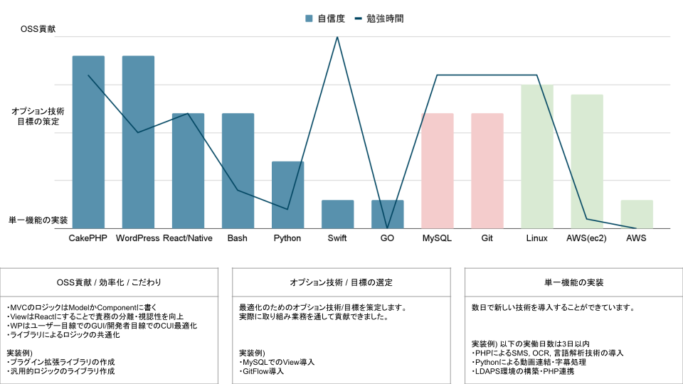

# 私について

## 🙇‍♂️ 基本情報

|key|value|
|---|---|
|氏名|藤本 凌 （Fujimoto Ryo）|
|生年月日|1999/03/29 (24歳)|
|居住地|栃木県|
|現年収|約4,100,000円

---

## 🧑‍💻 業務経験

高校卒業後、旅館等の接客業に携わっておりました。(お土産販売・お部屋案内) 
その後、現職であるWEB制作会社に入社しました。(バックエンド部署に所属し3月で3年目) 
詳細設計からDB設計、実装から運用/保守まで幅広く担当してきました。 
業務で利用しているメイン言語はPHP/CakePHPとReactです。([職務経歴書](https://ryofujimotox.github.io/resume/work_history)) 

---

## 技術レベル

|技術|実装例|目標|
|---|---|---|
|PHP/CakePHP | SMS, OCR, 言語解析技術の導入 社用エディタの作成(ブロック組立式のリッチエディタ) 共通処理のライブラリ化/バージョン管理 | ・OSS/チームでの開発 ・CI/CD(GithubAction)|
| WordPress | 社用テーマの作成 GUI最適化(ブロックエディタの拡張/メニュー追加) コード上でのCF・CPT管理ライブラリ作成 (ACF/SCF間で取得登録処理が異なるため、プラグインUIを利用しつつも柔軟にコード管理できるライブラリ) |
| React/ReactNative | SPAの導入 非同期データを取得するプロセスの最適化(無限スクロール) カスタムフックの活用(USB接続の検知/ページ離脱警告) | ・NextJSへの移行 ・Vercel環境 ・JWT認証 |
| Bash | サーバー構築の自動化/スクリプト化 (ユーザー作成, バーチャルホストSSL, WAF, zabbix ~ 再起動) |
| Python | ライブラリ作成/バージョン管理 GPIO制御 動画編集ツール作成 | 

---

### 直近の年収

約4,100,000円 (今年の給料up分 + ボーナス2回見込み)

---

---

## 🗂️ 担当工程

上流工程から下流工程までを一貫して担当しています。(SIer)

- 要件定義 ~ 詳細設計
- DB設計
- 実装 (CSS以外全般)
- テスト
- 運用/保守

---

## 🧐 意欲・興味

- 作業の自動化・効率化が得意です(Bash, Python)
- アウトプットをすることが得意です (社内Wiki, OSS)
- バックエンド、フロントエンド、およびインフラ全般に興味を持っています

---

## ✍ 課題

- バックエンドの課題は、OSSの開発量、OSSへ貢献すること
- フロントエンドの課題は、結合テスト・SSGの数を増やすこと
- DBの課題は、パーティショニング、レプリケーションの知識量を増やすこと
- インフラの課題は、AWSへの知識量を増やすこと

---

## ❗️ 希望条件

- 青森からフルリモートで働けることが一番の転職理由になります(月1回の出社等は可能)
- お給料は450万円以上か、成果次第で数年に越える見込みが欲しいです
- WEB(API,フロント)かアプリ開発のいずれか、または全部担当したいです
- どんどん新しい技術を身につけたいです
- 新しい技術をシステムに導入していきたいです
- そのために勤務時間内にも学び,反省の自由時間が欲しいです
- (その結果を提出・システムに導入します)

---

