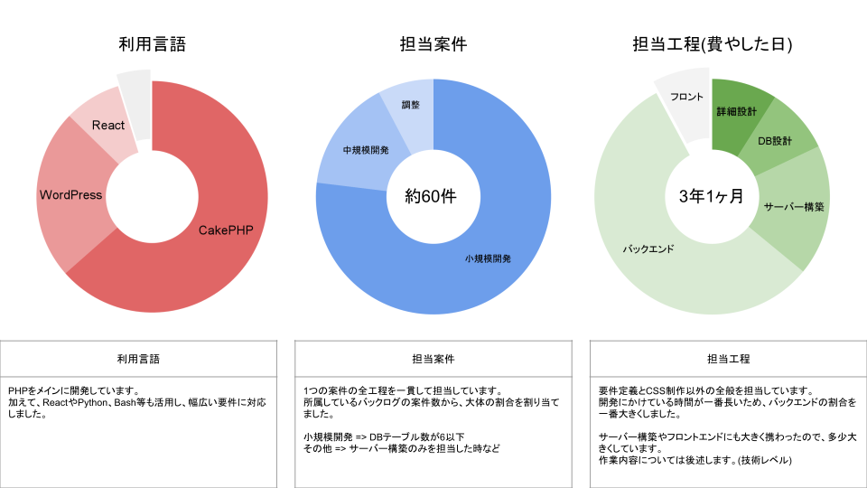

# 私について

## 基本情報

| key      | value                    |
| -------- | ------------------------ |
| 氏名     | 藤本 凌 （Fujimoto Ryo） |
| 生年月日 | 1999/03/29 (24 歳)       |
| 居住地   | 栃木県                   |
| 現年収   | 約 4,100,000 円          |

ポートフォリオ( https://ryo1999.com/ )

高校 2 年生の頃から、プログラミングを趣味にしています。 
高校卒業後 2 年間は、バイトをしながらアプリ開発に取り組みました。 
(複数のアプリをリリースしましたが、現在は公開していません。) 
その後、地に足をつけて働きたいと考え、2020 年 3 月に WEB 制作会社に入社しました。 
インフラ、バックエンド、フロントエンドを通じて幅広い知識を身につけました。 
この度、実家の青森からフルリモートで働きたいと考え、転職を決意しました。

---

### 現職においての活躍

質と量の点から部署で一番の評価をいただいており、自信が身につきました。 

- インフラ、バックエンド、フロントエンドに精通( 詳細は後述 )
- 小規模から中規模案件に幅広く担当( 計 180 件以上 )
- 業務の効率化( CMS 改修, ライブラリ追加, スクリプト作成 )
- 会社として知見のない技術の導入( SMS, OCR, LDAP 等 )
- 表示速度・UI の改善( Cache, SSG, React 等 )

職務経歴書( https://ryofujimotox.github.io/resume/work_history )

---

## 希望条件

- 青森からフルリモートで働くことが一番の転職理由です(月 1 回の出社等は可能)
- お給料は 450 万円以上をいただきたいです
- WEB(API,フロント)かアプリ開発のいずれか、または全部担当したいです
- 将来的にはマネジメントにも興味があります
- 勉強するためにプライベートを大切にしたいです

---

## 業務経験

### 案件規模

| 担当       | 内容                                                     | 目標/課題      |
| ---------- | -------------------------------------------------------- | -------------- |
| 見積       | 最大 400 万円/3 ヶ月                                     |
| チーム体制 | 5 名体制(営業、デザイナ、フロント CSS、バックエンド、QA) | ・チーム開発   |
| DB         | 最大 30 テーブル/70 万レコード                           | ・チューニング |
| サーバー   | VPS、ロードバランサ、スケールアップ                      |

---

## 技術レベル(言語)

### 詳細

| 技術                 | 実装例                                                                                                                                                                         | 目標                                             |
| -------------------- | ------------------------------------------------------------------------------------------------------------------------------------------------------------------------------ | ------------------------------------------------ |
| PHP/CakePHP          | ・SMS, OCR, 言語解析技術の導入 ・社用エディタの作成(ブロック組立式のリッチエディタ) ・共通処理のライブラリ化/バージョン管理                                              | ・チームでの開発 ・OSS 貢献 ・SSO 認証     |
| WordPress            | ・社用テーマの作成 ・GUI 最適化(ブロックエディタの拡張/メニュー追加) ・コード上での CF・CPT 管理ライブラリ作成 (別プラグイン間でも一元的にコード管理できるライブラリ) |
| React ReactNative | ・SPA の導入 ・非同期データを取得するプロセスの最適化(無限スクロール) ・カスタムフックの活用(USB 接続の検知/ページ離脱警告)                                              | ・NextJS への移行 ・Vercel 環境 ・JWT 認証 |
| Bash                 | ・サーバー構築の自動化/スクリプト化 (ユーザー作成, バーチャルホスト SSL, WAF, zabbix ~ 再起動)                                                                              |
| Python               | ・ライブラリ作成/バージョン管理 ・GPIO 制御 ・動画編集ツール作成  ・スクレイピング                                                                                    | selenium                                         |

---

## 技術レベル(インフラ周り)

### 詳細

| 技術  | 実装例                                                                                                                                                            | 目標                                  |
| ----- | ----------------------------------------------------------------------------------------------------------------------------------------------------------------- | ------------------------------------- |
| Git   | ・1 部署 2 人までのプルリクエスト連携 ・ライブラリに沿ったバージョン管理 ・GitFlow の個人利用                                                               | ・チーム連携 ・CI/CD(GithubAction) |
| MySQL | ・最大で 25 テーブルかつ 70 万レコードの設計・管理 ・基礎インデックスの利用(ユニーク, 外部キー) ・View/Trigger を利用した視認性の向上                       | ・パーティショニング/レプリケーション |
| NoSQL |                                                                                                                                                                   | ・DynamoDB                            |
| Linux | ・CentOS7 から別 OS への移行/マニュアル更新 ・サーバー構築の自動化/スクリプト化 ・LDAPS 環境の構築 ・ロードバランサ構築 ・スケールアップ/ディスク拡張 | ・クラウド環境への移行                |
| AWS   | ・Lambda ・API Gateway   ・AWS-EC2                                                                                                                          |
| GCP   |                                                                                                                                                                   |

---
